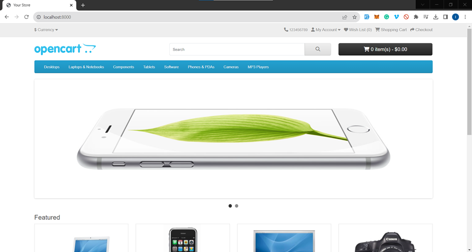
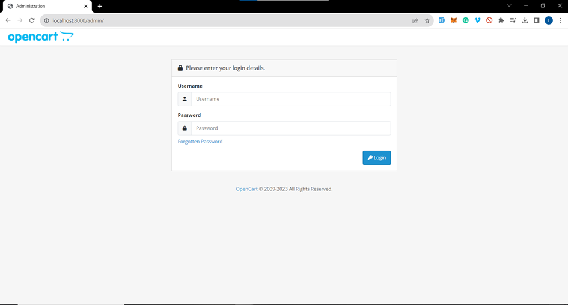

<!-- @format -->

# BUILD OPECART IMAGE

## Description

In this project, I aim to containerize the OpenCart platform using Docker technology.
This project leverages Docker's containerization capabilities to simplify the deployment and management of the OpenCart platform in various environments.

## OpenCart Overview

OpenCart is a robust and open-source e-commerce platform tailored for online merchants. It serves as an excellent and dependable foundation for constructing a successful online store. OpenCart is constructed on the PHP Model-View-Controller (MVC) architecture and relies on the MySQL database for data management.

## Docker Containerization

Due to the requirement of managing multiple environments, we have adopted a two-container approach. The first container is dedicated to the application, while the second one is reserved for the database. To efficiently manage and orchestrate these containers, we are using Docker Compose. In our setup, this configuration is referred to as a "multi-container" setup, ensuring that both the application and database run seamlessly within their respective containers.

## Structure

Here's an overview of the project's structure:

1. **Dockerfile**: This configuration file is used for creating a Docker image for the project.

2. **docker-compose.yaml**: This YAML file is used to configure and manage multiple Docker containers, ensuring seamless orchestration.

3. **cmd.sh**: A script designed to automate the installation and initialization of the OpenCart application.

4. **upload/**: This directory contains all the necessary files and resources for the OpenCart application, including PHP files, configuration files, and more. It is intended to be mounted within the Docker container.

## Getting Started

To get started with this project, follow these steps:

- Clone the project in your local machine

- Install Docker if you haven't already. You can download it from `https://docs.docker.com/`

- Open the docker-compose.yaml file and update the admin information as needed.

- Open your terminal and run the following command to start the containers in detached mode: `docker compose up -d`

- Open your web browser and visit "localhost:8000". You should see the following result:
  

- To access the admin panel, simply append "/admin" to the URL, and you will be redirected to the admin login page:
  
  Note: Be sure to use your login credentials after making the necessary changes in the `docker-compose.yaml` file.

That's it! Enjoy developing your e-commerce website! 😊🛒

## 🚀 About Me

I'm a Cloud DevOps enthusiastic...
